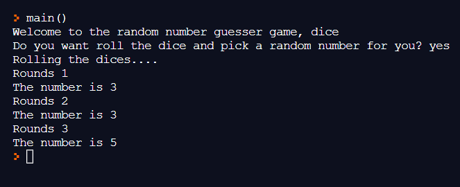

# Dice
This is a random number generator made using Python.
For this project, I have used `random` module and `.randint()` function to get a random number, `while` keyword to do loops,`.lower()` to convert uppercase characters in a string into lowercase, `def` to create a function and `return` to end the execution of the `def` function.
Hope this was helpful.

With this, I have attached the output of this project.

